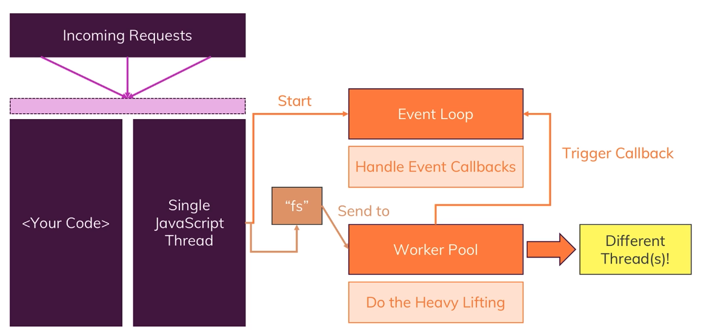
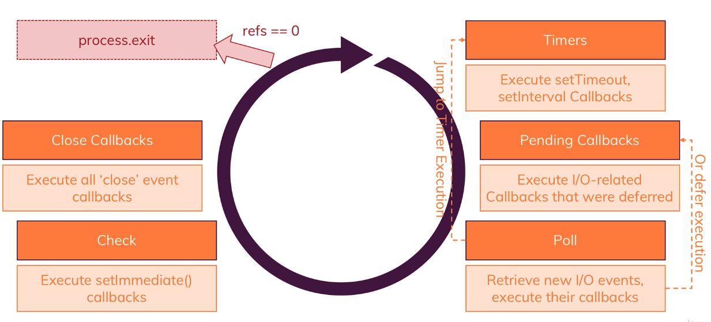

# Getting Started

- NodeJS is a JavaScript Runtime i.e. the original V8 Engine in the Chrome brower is modified (added necessary system interection features like interacting with the filesystem and removed unnecessary brower-dedicated features like interacting with the DOM) so that it can compile JavaScript code to run outside of the browser environment and instead on any machines.

- NodeJS is not just for implementing server applications (although this is its most popular purpose of usage). It can also be used to create scripts and build tools that can run on many systems.

- NodeJS is both a Web Server (can listen to requests from clients and send back responses) and a backend application (handle Authentication, Databases, Validation and other business logics necessary). The backend language PHP cannot listen to incoming requests and send back responses but rather it requires a separate Web Server software like nginx or apache

# Node.js Workflow

- Node.js app has only one single thread to execute the event loop
- Long-running tasks that may block code execution will be offloaded to another worker (another thread) in the work pool
- When the blocking work is done, an event is generated to trigger the handler callback managed by the event loop 
  
# The event loop
- The event loop manages all of the registered callbacks and call them when their according event happens

- During its lifetime, the event loop:
  - Executes any registered timer callback i.e. event occuring after some time or after every time interval
  - Executes pending callbacks, which are I/O callbacks that were deferred
  - Polls (retrieve) new I/O callbacks to execute their callbacks or defer them. Here the loop can also jump back to the timer callbacks if their events arrive
  - Checks and executes any `setImmediate` callbacks
  - Executes all `close` event callbacks
- The event loop is terminated when `process.exit` is called on the server process. This is also equivalent to `refs == 0` i.e. all callbacks are finished and removed

# npm 
## npm script
- To run a script of custom names, we need to use the command: `npm run <script name>`
  
## npm commands
- Install a package into the `devDependencies` with flag `--save-dev`
- Install a package globally (accessible across all node projects) with flag `-g`

# Nodejs Debugger
- In VS Code, open the `Run` or `Debug` menu and choose `Add configuration...`. This will open the `launch.json` file
- More options can be set between the pair of braces
- `"restart": true`: the debugger auto restarts when new changes are saved
- `"runtimeExecutable": "nodemon"`: the debugger will use nodemon instead of just node to start the server for debugging
- `"console": "integratedTerminal"`: output of the debug console also goes to the terminal